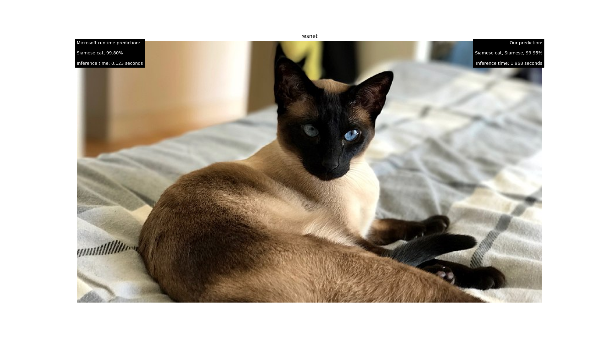

# ONNX RUNTIME PYTHON APP

This app is designed for testing the python binding and, at the same time, for comparing the performance of our implementation with respect to the official one provided by Microsoft.

Here is an example:


As we can see from the picture above, on the left we have the Microsoft official prediction and its inference time and, on the right, our prediction and inference time.
In addition, we can also find the network used to infer (**'resnet'** in the picture).


# How to run the application

## Prerequisites
Note that you need to have the onnxruntime official library installed on your PC. You can do this with the following command:

```
pip install onnxruntime
```
In addition, you should have been followed the instruction of our version of the library (click [here](../onnx-binding/README.md))
Furthermore, the following libraries are needed:
- [matplotlib.pyplot](https://matplotlib.org/3.5.3/api/_as_gen/matplotlib.pyplot.html)
- [PIL](https://pillow.readthedocs.io/en/latest/reference/Image.html)
- [numpy](https://numpy.org/)

You have to be in the current directory (**onnx-runtime-pyapp**) and type the following command on the terminal:
```
python3 main.py [image_name] [model_name]
```

image_name can be one of the following:
- american_flag
- apple_smith
- candle
- fireboat
- polaroid
- siamese-cat
- turtle

model_name can be one of these two models
- resnet
- mobilenet

By default, the application runs with **siamese-cat** and **resnet**.

You can specify only the image_name without specifying the model_name and it will run with the default model (resnet).
In order to specify also the model, you must specify the image_name.

Here are some examples on how to run the application:

This will run the default application. (siamese-cat and resnet).
```
python3 main.py
```

This will run the application with the fireboat image and resnet.
```
python3 main.py fireboat
```

This will run the application with the polaroid image and mobilenet.
```
python3 main.py polaroid mobilenet
```
